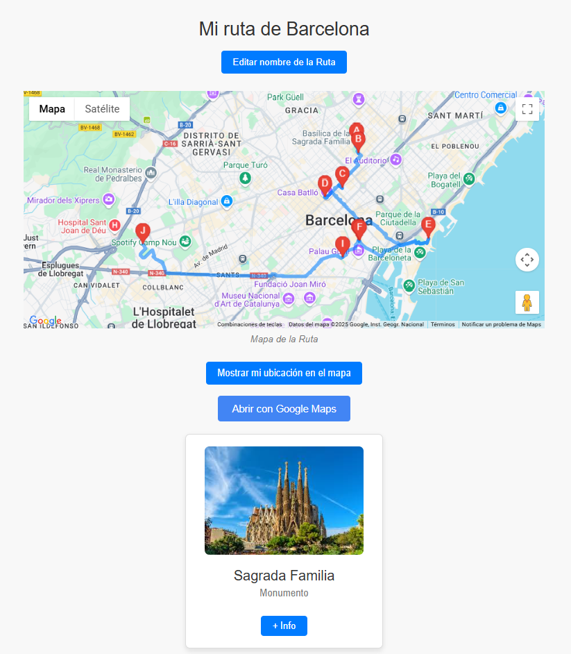

# CREADOR de RUTAS por Javi Ribas Pascual

[](https://app.netlify.com/sites/creadorderutas/deploys)

## Descripción

Creador de rutas es un asistente de viaje. Su función es la de recomendarte los puntos de interés que visitar al ir de viaje a una ciudad. Habiendo introducido el nombre de ésta podrás personalizar tu ruta turística con los puntos de interés que quieras conocer.

Entra en el siguiente enlace para utilizar la app: <https://creadorderutas.netlify.app/>



Para usar la aplicación es obligatorio registrarse (no es necesario que el mail sea válido, simplemente con *******@mail.com)

Esta aplicación está compuesta por varias páginas:

- Buscador
- Perfil
- Visionado/Edición de la ruta

### Buscador de ciudades

En el buscador, podremos introducir el nombre de una ciudad (fase beta: Barcelona, Madrid, Rio de Janeiro, Roma y Girona) para que la aplicación recomiende los puntos de interés a visitar en esa ciudad. Lo siguiente será seleccionar cuales de ellos estoy interesado en que formen mi ruta turística. Finalmente, al selecciopnar el botón de CREAR RUTA, la aplicación generará un mapa con una ruta pintada para visitar los puntos de interés seleccionados.

### Visionado y edición de la ruta

Los puntos de interés se mustran en el mapa según la distancia existente entre ellos (mayor eficiencia de la ruta). Esta página de visionado de la ruta te permite:

- Modificar el nombre de la ruta mediante el botón "Editar nombre de la Ruta"
- Ver un mapa estático.
- Añadir tu geolocalización en el mapa mediante el botón "Mostrar mi ubicación en el mapa".
- Iniciar la ruta con el gps de Google Maps mediante el botón "Abrir con Google Maps"
- Acceder a más información de cada punto de interés mediente el botón "+ Info"
- Agregar más puntos de interés a la ruta mediante el botón "Añadir Puntos de Interés"

La intención de esta página de la app, es que el usuario tenga la versión digital de un mapa físico, con la información detallada de aquello que está visitando, o, seguir la ruta en el gps externo.

### Perfil del usuario

En esta página, el usuario puede ver el listado de rutas que ha ido creando. Éstas rutas pueden ser eliminadas con el botón de "Eliminar", o, podmeos volver a la página de visionado de ruta seleccionando el botón "Editar"
El usuario también tiene la opción de cerrar su sesión o de eliminar la cuenta.

## Conocimientos aplicados

En este repositorio se aplican los siguientes recursos:

- HTML.
- CSS (Responsive).
- JavaScript: programación funcional, principios de SOLID, patrones de diseño.
- Javascript nativo y Lit Element como librería de componentes web.
- Servidor de estáticos y APIs REST con ExpressJS.
- Base de datos con MongoDB.
- Habilitación como PWA para poder instalarla en dispositivos móviles.
- TypeScript para el tipado del código
- JSdocs para la documentación
- GitHub para gestión de repositorios
- GitHooks y Linters para comprobación de errores en el código
- Jest como herramienta de testeo. En la carpeta /js/test hay varios ejemplos de testing
- Archivo api.mjs en la carpeta netlify/functions para poder desplegar el servidor en netlify, y netlify.toml en la raiz para su configuración

## Dependenciad de la app

- Node >= 20.0.0
- Express
- MongoDB
- JSDoc
- Typescript
- Jest
- ESLint
- Lint-Staged
- StyleLint
- Netlify (sólo si se va a desplegar en netlify)

## Plugins de VS

- GitHub Pull Requests
- Live Preview
- Live Server
- commitlint
- ESLint
- Conventional Commits
- Error Lens
- markdownlint
- Postman
- Stylelint
- lit-html

## Instalación y Ejecución

```bash
npm install
```

Es necesario ejecutar el terminal para el servidor del backend:

```bash
npm run server:express:start
```

Una vez en ejecución, podemos acceder al front end de la aplicación en: [http://127.0.0.1:1337](http://127.0.0.1:1337)

La configuración de los puertos está definida en el archivo .env, no incluído en el repositorio de git.

La aplicación gestiona los datos por medio de MongoDB. Como se ha explicado anteriormente, la aplicación solo se puede usar si el usuario está registrado, es por ello que se usa una simulación de OAuth para gestionar el login de usuario. La información del usuario se almacena en SessionStorage, redirigiendo a este a la página de inicio, si no está identificado.

(Crear usuario con formato @mail.com para el testeo).

## Interfaz

En la aplicación, se utilizan estilos responsive según el tamaño de la pantalla del usuario para mejorarar su experiencia de navegación. Esta mejora se consigue gracias al uso de propiedades Flex para esta funcionalidad.

Cada función/componente se ha creado intentando cumplir con los estándares de SOLID.

Existe la validación de tipados por medio de [JSDoc](https://jsdoc.app/) en los comentarios, y [ESLint](https://eslint.org/) tanto en los Git Hooks como apoyo por medio del plugin de VS Code.

## Documentación

Para generar la documentación de la aplicación se usa [JSDoc](https://jsdoc.app/) y se guarda en la carpeta `out`. Para verla puedes ejecutar el comando `npm run build:docs`.

## Modelo de datos

## Relación entre componentes

## Testeo

Utilizamos [Jest](https://jestjs.io/) como herramienta de testeo. Para poder ejecutar los test los hacemos por medio del comando:

npm run test

El fichero de configuración de jest es jest.config.js
